# muduo网络库

## 1.网络系统

前置知识，用于学习网络编程

### 1.1 零拷贝

#### 文件传输基本模型

- 由于最基本的传输方式是每次数据传输需要CPU与硬盘交互而引入的IO中断，期间CPU无法执行其他任务，因此引入了直接内存访问(Direct Memory Access)；DMA相当于是加在CPU和磁盘之间的中间层，相当与将IO传输的任务优先交给DMA控制器；
- DMA 收到磁盘的信号，将磁盘控制器缓冲区中的数据拷⻉到内核缓冲区中，此时不占⽤ CPU，待数据准备完毕后发送中断信号给CPU，此时再执行数据传输  

传统传输文件的方式：
最简单的方式即将磁盘上的⽂件读取出来，然后通过⽹络协议发送给客户端 

```c
read(file, tep_bur, len);
write(socket, tmp_bur, len);
```

这看似简单的操作实际涉及了**四次用户态和内核态的上下文切换**，一次是`read()`，一次是`write()`，进进出出，我们的操作系统；

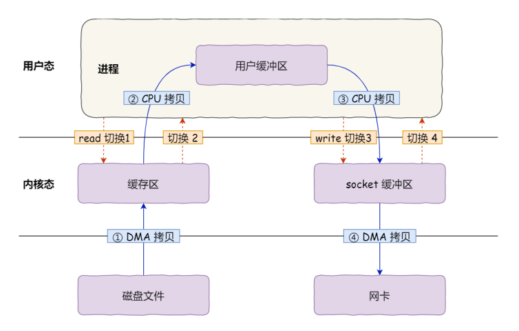

其中涉及到四次数据拷贝，两次是DMA的数据拷贝，两次是CPU的数据拷贝；要想提⾼⽂件传输的性能，就需要减少**⽤户态与内核态的上下⽂切换**和**内存拷⻉**的次数；很直观的，就是要减少系统调用的次数，同时，由于此时用户空间并未对其进行操作，可以尽量减少缓冲区的存在，比如直接取消用户缓冲区；

-----

那么问题来了，零拷贝的作用如何体现的；已知零拷贝实现的方式常有两种方式：

#### **mmap + write**

```c
buf = mmap(file, len);
write(sockfd, buf, len);
```

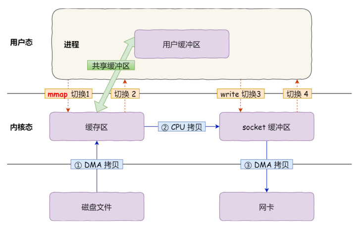

mmap()系统调用函数会直接将内核缓冲区里的数据直接映射用户空间，这样操作系统**内核态与用户态之间**就不需要任何数据拷贝操作；这样可以代替read()，但依然存在两次系统调用开销；

#### **sendfile**

在Linux内核版本2.1引入了sendfile()函数：

```c
#include <sys/socket.h>
ssize_t sendfile(int out_fd, int in_fd, off_t *offset, size_t count);
```

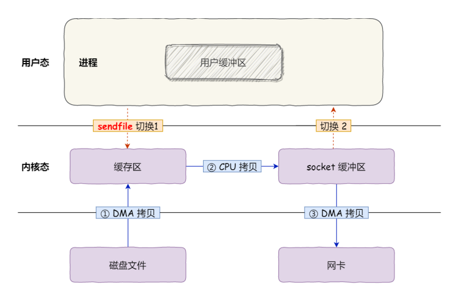

sendfile()可以代替read()和write()系统调用，从而减少一次系统调用，如果网卡支持SG-DMA，可以进一步减少通过把CPU内核拷贝到socket缓冲区的过程

```bash
$ ethtool -k eth0 | grep scatter-gather
scatter-gather: on
        tx-scatter-gather: on
        tx-scatter-gather-fraglist: off [fixed]
```

如果显示如上，说明网卡支持scatter-gather功能;此时传输时无需再将操作系统内核缓冲区数据拷贝到socket缓冲区，减少一次数据拷贝；

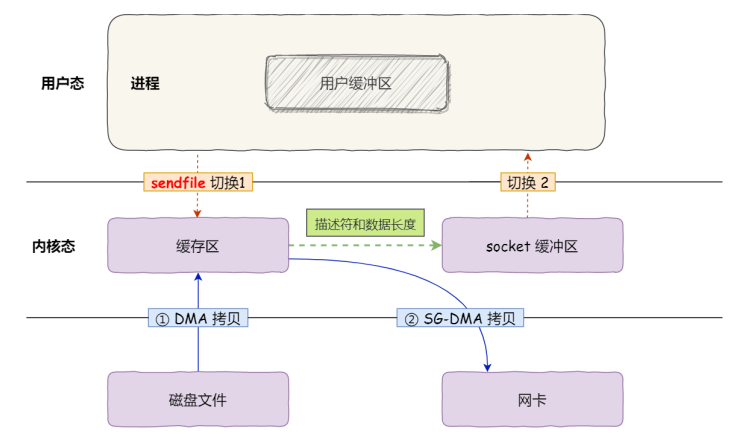

这就是所谓的**零拷⻉（Zero-copy）技术**，因为我们没有在内存层⾯去拷⻉数据，也就是说全程没有通过CPU 来搬运数据，所有的数据都是通过 DMA 来进⾏传输的；减少了两次上下文切换，同时减少了两次数据拷贝，且拷贝过程均通过DMA来搬运；

#### **PageCache**

上文所说的内核缓冲区实际上是磁盘高速缓存即PageCache；由于程序运行具有局部性，所以可以使用PageCache来缓存最近访问的资源，当空间不足时淘汰最久未访问的缓存，即LRU策略；

读取磁盘数据的时候，需要找到数据所在的位置，但是对于机械磁盘来说，就是通过磁头旋转到数据所在的扇区，再开始「顺序」读取数据，但是旋转磁头这个物理动作是⾮常耗时的，为了降低它的影响， PageCache 使⽤了**预读功能**，比如read()每次读取32kb数据，PageCache直接读入64kb数据存入，当然劣势也是明显的，在传输大文件时这就是纯浪费性能；

那大文件用啥传？


直接考虑引入异步IO解决；很显然，对于磁盘来说，异步IO是直接IO的，是绕过了PageCache的；

大文件传输不应该使用PageCache，因为会导致热点小文件无法使用，例如在nignx内，可以配置调整大小来确定使用什么方式传输文件

```lua
location /video/{
    sendfile on;
    aio;
    directio 1024m;
}
```

#### **延申：CUDA零拷贝**

在支持统一虚拟地址空间（Unified Virtual Addressing）的系统中，CPU 和 GPU 共享统一的虚拟地址空间，设备可直接用虚拟地址访问主机内存，在共享物理内存的架构中效率更高；

cudaHostAlloc()分配的主机内存是**页锁定（Page-Locked）内存**，确保物理地址固定（不会被操作系统换页到磁盘），GPU 可以直接通过 PCIe 总线访问；

访问主机内存时，GPU 通过 PCIe 的 **Peer-to-Peer（P2P）** 或 **Host Memory Mapping** 机制直接读写，无需显式拷贝，操作完毕后需要引入显式的cudaDeviceSynchronize()保证数据一致性；

### 1.2 IO多路复用

#### socket基本模型

以服务端接收客户端连接为例

1. 服务端调用bind()接口，将给定的socket_fd绑定在特定的IP地址和端口号上；绑定端口是为了通过内核接收到的TCP报文确定端口号再传输数据，绑定IP的原因是因为每个网卡都有其独立的IP地址；
2. 绑定以后，启用listen()函数进行监听，和tcp监听的操作一致，可以通过`netstat`来查看对应端口号有无被监听；
3. 监听之后，调用accept()函数从内核获取客户端请求，如果没有，则会阻塞等待客户端连接；
4. 客户端创建socket并调用connect()触发三次握手；

​	在TCP连接过程中，服务器的内核实际为每个socket都维护了两个队列：

- 一个称为TCP半连接队列，没有完成三次握手，此时服务端处于syn_rcvd的状态
- 一个称为TCP全连接队列，已完成三次握手，此时服务端处于established状态；

​	当 TCP 全连接队列不为空后，服务端的 accept() 函数，就会从内核中的 TCP 全连接队列⾥拿出⼀个已经完成连接的 socket 返回应⽤程序，后续数据传输都⽤这个 socket；监听的 socket 和真正⽤来传数据的 socket 是两个：⼀个叫作监听 socket；⼀个叫作已连接 socket；建立连接以后就可以互相read()和write()了

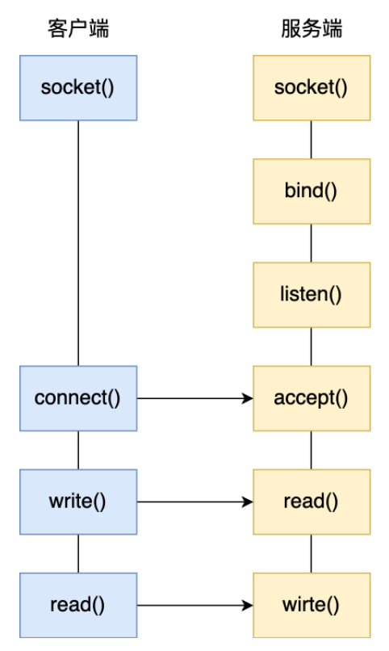

在Linux中，每个进程都有一个task_struct，该结构体中存在一个指向**文件描述符数组**的成员指针，数组中会列出这个进程打开的所有文件的文件描述符，内核可以通过数组索引获取指针找到对应打开的文件；每个文件存在一个inode，socket文件的inode指向内核中的socket结构，其中存在两个队列，即发送队列和接受队列，以链表形式存储的数据即 `struct sk_buff{};`（socket Buffer）

**`sk_buff`**用于表示各个层的数据包，应用层称data，传输层(以TCP协议为例)称segment，网络层(以IP协议为例)称packet，接口层称frame；

```c
struct sk_buff {
    // 链表管理
    struct sk_buff  *next;
    struct sk_buff  *prev;
    
    // 数据包状态
    ktime_t         tstamp;      // 时间戳
    unsigned int    len;         // 数据总长度
    unsigned int    data_len;    // 分片数据长度
    __u16           protocol;    // 协议类型（ETH_P_IP等）
    
    // 网络协议头指针
    union {
        struct tcphdr   *th;
        struct udphdr   *uh;
        struct icmphdr  *icmph;
        // ...其他协议头
    } h;
    
    // 数据缓冲区管理
    unsigned char *head;    // 缓冲区起始地址
    unsigned char *data;    // 当前数据起始地址
    unsigned char *tail;    // 当前数据结束地址
    unsigned char *end;     // 缓冲区结束地址
    
    // 网络设备信息
    struct net_device *dev; // 关联的网络设备
    
    // 控制信息
    __u32           priority;   // QoS优先级
    __u32           hash;       // 哈希值（用于路由/负载均衡）
    
    // 引用计数
    atomic_t        users;      // 引用计数
    // ...其他字段（内核版本不同可能有差异）
};
```

由于网络协议栈的设计是分层结构，从上层至下传递增加包头，反之则去除包头，层间传递避免拷贝则使用一个结构体提高CPU效率；

通过调整sk_buff中的`data`指针，即可通过偏移实现对应层的访问以及传输协议的选择；

- L2（链路层）：通过`skb->mac_header`访问MAC头;

- L3（网络层）：通过`skb->network_header`访问IP头;

- L4（传输层）：通过`skb->transport_header`访问TCP/UDP头;


```c
// 添加TCP头（移动data指针）
skb_push(skb, tcp_hdrlen);
// 剥离以太网头（移动data指针）
skb_pull(skb, ETH_HLEN);
```

上述TCP socket使用的是一对一同步阻塞的通信方式，显然实际的网络模型不是这样的，一个服务器理应服务数量众多的客户端；

由于一次TCP连接是由一个四元组唯一确定的，即本机IP、端口IP、对端IP、对端端口；

服务器的本地IP和端口可以视为固定监听的，所以理论上来说可以视为最大TCP连接数 = 客户端最大连接请求数；对于IPV4来说，IP数最多为$2^{32}$，端口数最多为$2^{16}$，所以理论上来说能达到$2^48$，但由于文件描述符（通常为1024，通过ulimit修改）和系统内存的限制，理论值显然不可能；

现在引入经典问题Client 10,000；

如果服务器只有2GB，网卡是千兆的，则单纯从硬件资源来分析，如果每个请求占用不到200kB内存和100Kbit的带宽即可实现；

#### 多进程模型

最基本的想法，如果需要支持多个客户端，就引入多个进程进行处理；

由于服务器一旦和客户端连接，会通过accpet()返回一个已连接socket，此时调用[fork()](../srcs/1.操作系统.md## 1.2.进程与进程间通信)创建一个子进程，将父进程所有的数据复制一份，通过返回值确定是子进程还是父进程（子进程返回0）；这样，子进程无需关心监听socket，父进程无需关心已连接socket

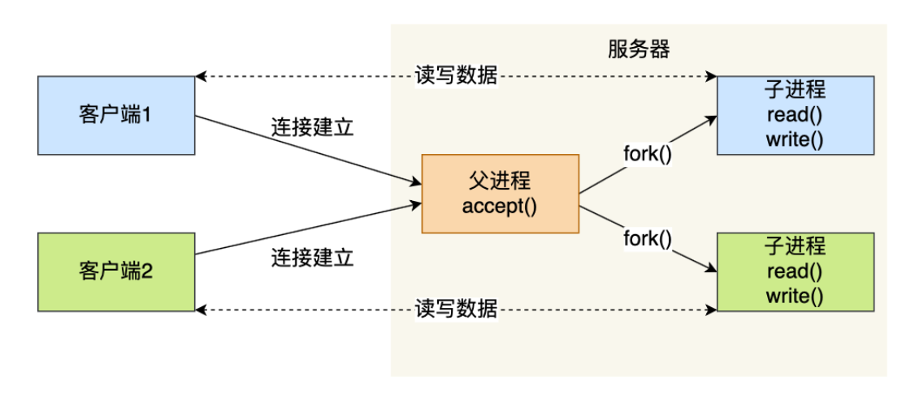

当子进程退出时，实际上内核依然会保留该进程的信息，为避免其成为[僵尸进程](../srcs/1.操作系统.md### 1.3.1僵尸进程及其处理)，需要做好回收处理；父进程可以通过调用wait()和waitpid()实现资源管理；

进程的上下⽂切换不仅包含了虚拟内存、栈、全局变量等⽤户空间的资源，还包括了内核堆栈、寄存器等内核空间的资源；这样的多进程模型其实并不适合网络的高并发连接。（参考：[多进程与多线程适用场景](../srcs/1.操作系统.md)）

#### 多线程模型

由于进程是系统资源分配的基本单位，线程是程序调度的基本单位；一个进程可运行多个线程，线程切换时只需要切换线程的私有数据，寄存器等，开销远小进程切换；当服务器与客户端建立TCP连接后，通过pthread_create()函数创建线程，然后将已连接socket的fd传递给线程，从而实现并发处理；当然，如果频繁创建和销毁线程，那么开销也是很大的；

这时可以考虑引入池化技术进行管理，即所谓的线程池；通过提前创建数个线程，这样每次接收到一个已建立连接的socket，直接放入队列即可；

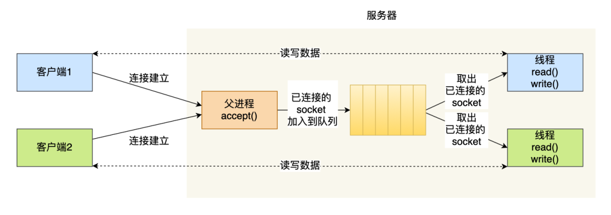

显然，这个队列应该是全局可见的，即需要通过一定的同步机制保证线程安全，例如使用加互斥锁的方式；不过即使这种方式也存在很大的问题，C10K问题下，相当于维护一万个进程/线程，也是不行的；

#### I/O多路复用

既然每个请求都为其分配独立的socket的方式不可行，那就一个进程维护多个socket；即[I/O多路复用](../srcs/2.网络编程.md)；

一个进程每个时刻只能处理一个请求，但如果每次耗时1ms，那么1s可以处理上千次请求，即类似CPU的并发进程，也称时分多路复用；

Linux提供的select/poll/epoll就是基于上述概念实现的系统调用，进程可以通过一个系统调用从内核获取多个事件；

`select`通过将文件描述符都放在一个**文件描述符集合**中，再将其**拷贝**到内核内，让内核**遍历**集合检查，当有事件产生后再标记socket为可读或可写，然后再**拷贝**回用户态，用户态再进行遍历；所以此处两次遍历两次拷贝，且select使用固定长度的BitsMap，所支持的文件描述符有限，默认最大值为1024（由Linux内核的FD_SETSIZE决定，默认1024，监听0~1023文件描述符）；

`poll`相比select的BitsMap，采取了动态数组，用链表形式进行组织，突破select的限制，但是依然受系统文件描述符限制；本质上二者都是通过线性结构存储进程关心的socket集合，因此时间复杂度都是O(n)，且需要内核态和用户态互相拷贝；

`epoll`解决的办法是什么？

首先，由于线性检测的方式太低效，难办那就别办了，由于红黑树增删查的时间复杂度都是O(logn)，直接用**红黑树来跟踪所有待检测的文件描述字**，把需要监控的socket通过`epoll_ctl()`添加到内核中的红黑树中，这样每次只需要传入一个socket，大幅减少了内核和用户空间的数据拷贝以及对应的内存分配；

其次，epoll采取[事件驱动](../srcs/2.网络编程.md## 1.2 事件驱动编程模式)的机制，其核心是**基于事件的发生来驱动程序的执行**，程序不主动等待事件，而是通过**注册事件处理函数**；通过内核里维护一个链表来记录就绪事件，每当socket事件发生时，通过回调函数，内核回将其加入到就绪事件中，当调用`epoll_wait()`时，只会返回有事件发生的文件描述符的个数；

```c
int sock_fd = socket(AF_INET, SOCK_STREAM, 0);

int epfd = epoll_create1(0);
struct epoll_event ev;
ev.events = EPOLLIN; // 监听可读事件
ev.data.fd = sock_fd;
epoll_ctl(epfd, EPOLL_CTL_ADD, sock_fd, &ev);

while (1) {
    struct epoll_event events[MAX_EVENTS];
    int n = epoll_wait(epfd, events, MAX_EVENTS, -1); // 阻塞等待事件
    for (int i = 0; i < n; i++) {
        if (events[i].data.fd == sock_fd) {
            // 事件处理
            handle_event(events[i].data.fd);
        }
    }
}
```

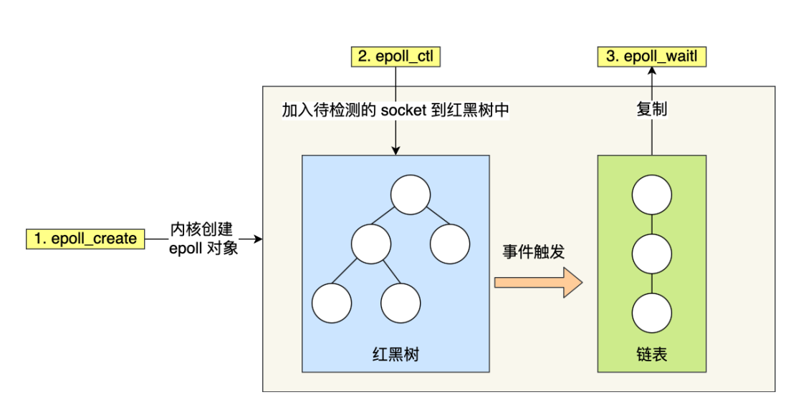

`epoll`的方式即使监听的socket不断增加，效率依然不会大幅降低，上限为系统定义的进程打开的最大文件描述符个数；`epoll`通常视为解决C10K问题的最佳实现；注意，`epoll`将文件描述符返回的过程依然是调用了`__put_user`函数，即从内核空间拷贝到用户空间；

`epoll`支持两种触发方式，即水平触发和边缘触发：

- 水平触发(Level Triggered)：服务端会一直从`epoll_wait`中苏醒，直到内核缓冲区数据被`read`全部读取结束；
- 边缘触发(Edge Triggered)：服务端只会再可读事件发生时苏醒一次，即使没有调用`read`函数，也需要确保所有的数据一次性被读取完毕；

由特性可知，一般采取边缘触发的场景需要尽可能地读取数据，以免丢失读取的机会，因此通常会循环读取，通过与**非阻塞I/O**搭配使用，程序会一直执行I/O直到系统调用返回错误即可退出程序；例如read和write返回EAGAIN或EWOULDBLOCK

### 1.3 高性能网络模式：Reactor和Proactor

上文中，提到了线程池对于性能的优化，但是线程应该如何高效的处理业务呢；
已知一个连接对应一个线程的逻辑下，处理一般采取**read->业务处理->send**，如果当前线程无数据可读，就会阻塞在read操作上，该线程就会阻塞，但是不会影响其他线程；不过，如果引入了线程池，一个线程要处理多个连接的业务，线程在处理某个连接的read操作时，如果遇到没有数据可读，那么其他连接的业务就无法处理了；如果将socket改成非阻塞，使用轮询调用read来解决，这样简单粗暴但显然不是最优解；最主要的问题是，线程判断数据是否可读是通过read函数实现的；这个点，就再次回到了事件驱动那里说的了，和之前的I/O多路复用需要解决的问题一致了；

由于I/O多路复用的开发方式是基于面向过程的，此处即引入了Reactor模式，由处理资源池和Reactor共同组成；

Reactor 模式也叫 Dispatcher 模式，即 I/O 多路复⽤监听事件，收到事件后，根据事件类型分配（Dispatch）给某个进程 / 线程  ；

- Reactor 负责监听和分发事件，事件类型包含连接事件、读写事件；
- 处理资源池负责处理事件，如 read -> 业务逻辑 -> send；

由于Reactor模式是灵活多变的，不固定Reactor以及处理资源池的线程/进程数，因此可延伸出四种方案，由于多Reactor单线/进程相比单Reactor单线/进程没有性能优势，因此一般采取：（Java一般采取线程，例如Netty；C进程线程都行，Nginx是进程，Memcache是线程）

- 单 Reactor 单进程 / 线程；
- 单 Reactor 多线程 / 进程；
- 多 Reactor 多进程 / 线程；  

#### 单 Reactor 单进程

一般来说，C语言采取的是单Reactor单进程，因为C编写的程序运行时就是个独立的进程，不需要在进程中再创建线程；而Java语言的实现则一般是单Reactor单线程，因为JVM本身就是个进程；

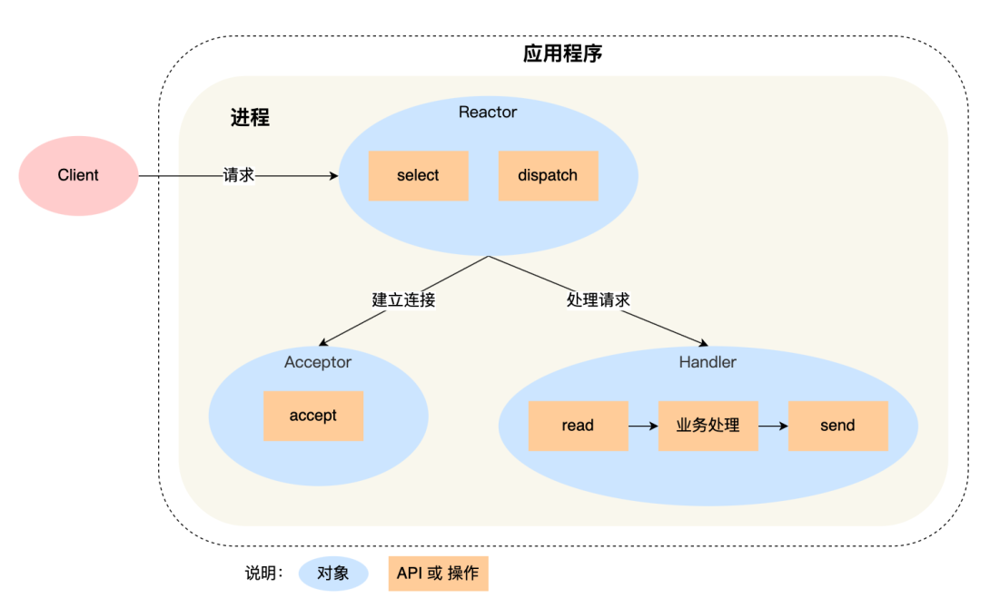

- Reactor对象通过select（I/O多路复用接口）监听事件，分析事件类型通过dispath分配给Acceptor或Handler；
- 如果是建立连接，就给Acceptor，如果不是，则交给Handler;

这方案实现起来很简单，也无需考虑IPC问题，但是缺点也是明显的，单进程无法利用多核CPU性能，且Handler处理时业务处理耗时会导致响应的延迟；

所以这种方案仅适合业务处理非常快速的场景，并不适用与计算密集型场景；例如Redis就是一个典例，由于Redis处理主要是位于内存中那个，性能瓶颈不在CPU上，所以 **Redis** 对于命令的处理是单进程的；

#### 单 Reactor 多线程

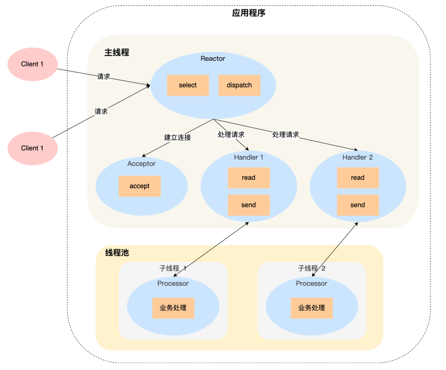

如图，前面的操作和单进程是一致的，但是：

- Handler对象的功能不再负责业务处理，而是只负责数据的收发，Handler通过read读取到数据后，分发给Processor;
- 子线程的Processor对象进行业务处理，再将数据发给主线程的Handler对象，通过send方法返回给client；

优势在于充分利用多核CPU性能，那缺点也很明显，数据竞争与线程同步问题；

单 Reactor 多进程相⽐单 Reactor 多线程实现起来很麻烦，主要因为要考虑⼦进程 <-> ⽗进程的双向通信，并且⽗进程还得知道⼦进程要将数据发送给哪个客户端；⽽多线程间可以共享数据，虽然要额外考虑并发问题，但是这远⽐进程间通信的复杂度低得多，因此实际应⽤中也看不到单 Reactor 多进程的模式；

#### 多 Reactor 多进程 / 线程

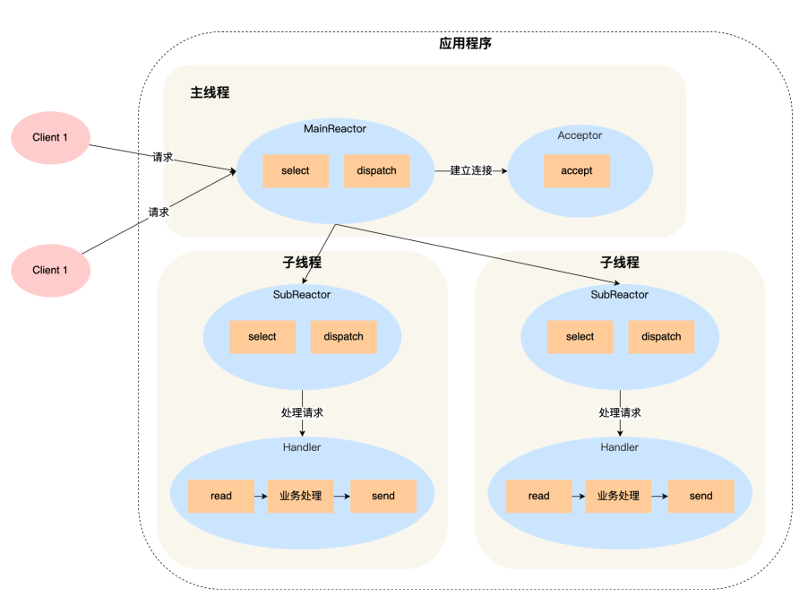

⽅案如下：

- 主线程中的 MainReactor 对象通过 select 监控连接建⽴事件，收到事件后通过 Acceptor 对象中的accept 获取连接，将新的连接分配给某个⼦线程；
- ⼦线程中的 SubReactor 对象将 MainReactor 对象分配的连接加⼊ select 继续进⾏监听，并创建⼀个Handler ⽤于处理连接的响应事件；
- 如果有新的事件发⽣时， SubReactor 对象会调⽤当前连接对应的 Handler 对象来进⾏响应；
- Handler 对象通过 read -> 业务处理 -> send 的流程来完成完整的业务流程；

多Reactor多线程的实现更加简单：

- 主线程和子线程分工极为明确，主线程只负责新连接，子线程负责完成其他所有处理
- 主线程和⼦线程的交互很简单，主线程只需要把新连接传给⼦线程，⼦线程⽆须返回数据，直接就可以在⼦线程将处理结果发送给客户端  

Netty和Memcache即采用的上述方案；

至于**Nginx**，是使用的多Reacor多进程，不过有些略微差异，具体表现在主进程仅进行初始化socket，并不管理accept连接，通过锁控制每次子进程只有一个accpet(防止惊群)，子进程accept新连接后就放到⾃⼰的 Reactor 进⾏处理，不会再分配给其他⼦进程 ；

#### Proactor

Reactor是典型的[非阻塞同步网络模式](../srcs/2.网络编程.md)，而Proactor是异步网络模式

- 阻塞I/O的阻塞等待的核心是**内核数据准备好**和**数据从内核态拷⻉到⽤户态**这两个过程；
- 非阻塞I/O最后⼀次存在 read 调⽤，获取数据的过程也是⼀个同步的过程，即**内核态的数据拷⻉到⽤户程序的缓存区**这个过程；
- 无论阻塞还是非阻塞，本身都属于同步I/O的范畴；

真正的[异步I/O](../srcs/2.网络编程.md)是数据准备和数据拷贝过程均无需等待，所有数据拷贝操作均由内核发起，应用程序不主动参与拷贝动作，即：

- Reactor 是**⾮阻塞同步⽹络模式**，感知的是**就绪可读写事件**。在每次感知到有事件发⽣（⽐如可读就绪事件）后，就需要应⽤进程主动调⽤ read ⽅法来完成数据的读取，也就是要**应⽤进程主动将socket 接收缓存中的数据读到应⽤进程内存**中，这个过程是同步的，读取完数据后应⽤进程才能处理数据。
- Proactor 是**异步⽹络模式**， 感知的是**已完成的读写事件**。在发起异步读写请求时，需要**传⼊数据缓冲区的地址（⽤来存放结果数据）等信息**，这样系统内核才可以⾃动帮我们把数据的读写⼯作完成，这⾥的**读写⼯作全程由操作系统来做**，并不需要像 Reactor 那样还需要应⽤进程主动发起 read/write来读写数据，操作系统完成读写⼯作后，就会**通知应⽤进程直接处理数据**。

不过无论是上述哪种编程模式，都可以视为[事件驱动](../srcs/2.网络编程.md##1.2 事件驱动编程模式)的编程模式；

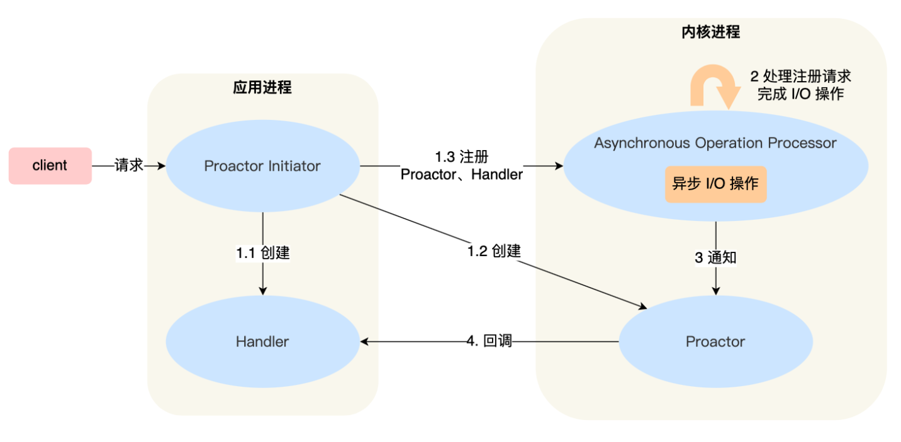

具体流程：

- Proactor Initiator 负责创建 Proactor 和 Handler 对象，并将 Proactor 和 Handler 都通过Asynchronous Operation Processor 注册到内核；
- Asynchronous Operation Processor 负责处理**注册请求**，并处理 I/O 操作； 
- Asynchronous Operation Processor 完成 I/O 操作后**通知** Proactor；
- Proactor 根据不同的事件类型**回调不同的 Handler 进⾏业务处理**； Handler 完成业务处理；

`libaio`本身是由Linux对本地文件的异步操作较好，但网络I/O不支持，`io_uring`才完整的实现了异步I/O;基于 Linux 的⾼性能⽹络程序都是使⽤ Reactor ⽅案  

Windows的IOCP接口时操作系统级别的异步I/O，真正意义的异步，可以在Windows Server上实现高效的Proactor方案；

## 2.muduo-core

项目实现，基于主从多Reactor多线程的网络库实现，并发模型如下：


### 组件对应关系

|   理论模型    |     muduo实现类      |            功能说明            |
| :-----------: | :------------------: | :----------------------------: |
| Main Reactor  | `EventLoop` (主线程) | 运行`Acceptor`，处理新连接事件 |
|  Sub Reactor  |  `EventLoopThread`   |   每个IO线程独立运行事件循环   |
| Demultiplexer |    `EPollPoller`     |    封装epoll_wait等系统调用    |
|     Event     |      `Channel`       |    管理文件描述符和事件回调    |

### 简单案例：EchoServer

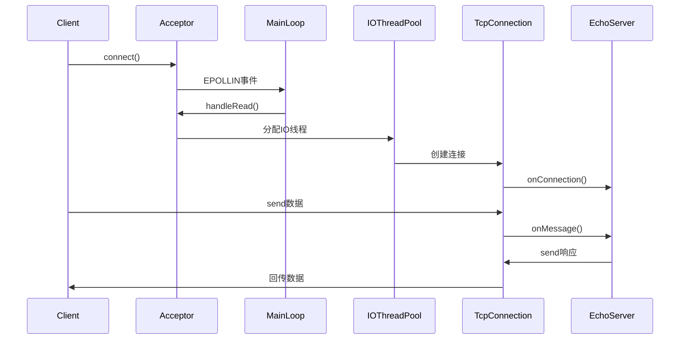

首先给出EchoServer.cpp的代码

```cpp
#include "Logger.h"
#include "TcpServer.h"

class EchoServer : public std::enable_shared_from_this<EchoServer> {
public:
    using Ptr = std::shared_ptr<EchoServer>;

    static Ptr create(EventLoop* loop, const InetAddress& addr, const std::string& name) { return std::make_shared<EchoServer>(loop, addr, name); }
    EchoServer(EventLoop* loop, const InetAddress& addr, const std::string& name) : loop_(loop), server_(loop, addr, name) {}
    ~EchoServer() = default;
    void start() {
        auto self = shared_from_this();
        server_.setConnectionCallback([self](const TcpConnectionPtr& conn) { self->onConnection(conn); });

        server_.setMessageCallback([self](const TcpConnectionPtr& conn, Buffer* buf, TimeStamp time) { self->onMessage(conn, buf, time); });

        server_.setThreadNum(4);
        server_.start();
    }

private:
    EventLoop* loop_;
    TcpServer server_;
    void onConnection(const TcpConnectionPtr& conn) {
        if (conn->connected()) {
            LOG_INFO("Connection Up : %s", conn->peerAddress().toIpPort().c_str());
        } else {
            LOG_INFO("Connection closed [%s -> %s]", conn->localAddress().toIpPort().c_str(), conn->peerAddress().toIpPort().c_str());
        }
    }
    void onMessage(const TcpConnectionPtr& conn, Buffer* buf, TimeStamp time) {
        std::string request = buf->retrieveAllAsString();
        // 简易HTTP协议识别
        if (request.find("GET / HTTP/1.") != std::string::npos) {
            std::string response = "HTTP/1.1 200 OK\r\n"
                                   "Content-Length: 13\r\n"
                                   "\r\n"
                                   "Hello, World!";
            conn->send(response);
        }
        // 保持原有TCP回显逻辑
        else {
            conn->send(request);
        }
    }
};

int main() {
    EventLoop loop;
    InetAddress addr("127.0.0.1", 8000);
    auto server = EchoServer::create(&loop, addr, "EchoServer");
    server->start();
    loop.loop();
    return 0;
}
```

如上代码，此时：

**1.  进行核心类的初始化构建**

```cpp
    EventLoop loop;
    InetAddress addr("127.0.0.1", 8000);
    auto server = EchoServer::create(&loop, addr, "EchoServer");
```

 - **`EventLoop` 创建**
   - 主线程的事件循环对象初始化，创建 `epoll` 实例
   - 初始化任务队列和唤醒管道（此处选择使用`wakeupFd_`，用于跨线程通信）
 - **`TcpServer` 构造**
   - 内部创建 `Acceptor` 对象，绑定到 `127.0.0.1:8000`
   - 创建 `EventLoopThreadPool` 线程池（此时未启动）

**2.  进行服务启动**

```cpp
server->start();
```

**2.1 设置回调函数**

分别负责注册连接建立/断开回调，注册消息到达回调

```cpp
auto self = shared_from_this();
server_.setConnectionCallback([self](const TcpConnectionPtr& conn) {
    self->onConnection(conn);
});
server_.setMessageCallback(...);
```

**2.2 启动线程池**

创建4个 `EventLoopThread` 线程，每个线程创建独立的 `EventLoop` 并开始 `loop()`，主线程的 `EventLoop` 保持运行（处理新连接）

```cpp
server_.setThreadNum(4);  // 创建4个IO线程
server_.start();          // 启动线程池
```

**2.3 开始监听**

主线程开始调用Acceptor的监听接口，绑定到`EventLoop`的`Channel`上，关注`EPOLLIN`事件

```cpp
// 开启服务器监听
void TcpServer::start() {
    if (started_.fetch_add(1) == 0) {  // 防止一个TcpServer对象被start多次
        threadPool_->start(threadInitCallback_);  // 启动底层的loop线程池
        loop_->runInLoop([this] {  // 依赖TcpServer对象保持存活
            acceptor_->listen();
        });
    }
}
// 调用Acceptor的listen接口
void Acceptor::listen() {
    listenning_ = true;
    acceptSocket_.listen();
    acceptChannel_.enableReading();  // 核心操作：将acceptChannel_注册到Poller
}
// 调用Socket的listen系统调用
void Socket::listen() {
    if (::listen(sockfd_, 1024) != 0) {
        LOG_FATAL("listen socket fd:%d fail", sockfd_);
    }
}
```
**3. 事件循环运行**

```cpp
loop.loop();
```

**3.1 接受新连接**

客户端连接配置好的IP端口进行连接触发`EPOLLIN`事件，`Acceptor::handleRead()`调用

```cpp
// 触发Handler
void Acceptor::handleRead() {
    InetAddress peerAddr;
    int connfd = acceptSocket_.accept(&peerAddr);
    if (connfd >= 0) {
        if (NewConnectionCallback_) {
            NewConnectionCallback_(connfd, peerAddr);
        } else {
            ::close(connfd);
        }
    } else {
        LOG_ERROR("%s:%s:%d accept err:%d\n", __FILE__, __FUNCTION__, __LINE__, errno);
        if (errno = EMFILE) {
            LOG_ERROR("%s:%s:%d sockfd reached limit\n", __FILE__, __FUNCTION__, __LINE__);
        }
    }
}
// 调用 accept4() 接受连接，获取客户端socket
int Socket::accept(InetAddress* peerAddr) {
    sockaddr_in addr;
    socklen_t len = sizeof(addr);
    ::memset(&addr, 0, len);
    // 将返回的连接 fd 设置为非阻塞
    int connfd = ::accept4(sockfd_, (sockaddr*) &addr, &len, SOCK_NONBLOCK | SOCK_CLOEXEC);
    if (connfd >= 0) {
        peerAddr->setSockAddr(addr);
    }
    return connfd;
}
// 创建 TcpConnection 对象
TcpServer::TcpServer(EventLoop* loop, const InetAddress& listenAddr, const std::string& nameArg, Option option) :
    loop_(CheckLoopNotNull(loop)),
    ipPort_(listenAddr.toIpPort()),
    name_(nameArg),
    acceptor_(new Acceptor(loop, listenAddr, option == kReusePort)),
    threadPool_(new EventLoopThreadPool(loop, name_)),
    nextConnId_(1),
    started_(0),
    connectionCallback_(),
    messageCallback_() {  
    // 当有新用户连接时，Acceptor类中绑定的acceptChannel_会有读事件发生，执行handleRead()调用TcpServer::newConnection回调
    acceptor_->setNewConnectionCallback([this](int sockfd, const InetAddress& listenAddr) { this->newConnection(sockfd, listenAddr); });
}

// 每当有新用户连接时，acceptor会执行回调操作
// 将mainLoop接收到的强求连接通过回调轮询分发给subLoop
void TcpServer::newConnection(int sockfd, const InetAddress& peerAddr) {
    // 轮询算法：选择一个subLoop来管理connfd对应的channel
    EventLoop* ioLoop = threadPool_->getNextLoop();

    // ++nextConnId_;  // 没有设置为原子类是因为其只在mainloop中执行，不存在线程安全问题
    int connId = nextConnId_.fetch_add(1, std::memory_order_relaxed); // 即使如此依然需要全部采取原子操作保持一致性
    char buf[64] = {0};
    snprintf(buf, sizeof buf, "-%s#%d", ipPort_.c_str(), connId); // 注意：通过load()方法获取原子变量的值
    std::string connName = name_ + buf;
    LOG_INFO("TcpServer::newConnection [%s] - new connection [%s] from %s\n", name_.c_str(), connName.c_str(), peerAddr.toIpPort().c_str());

    sockaddr_in local;
    socklen_t addrLen = sizeof(local);
    ::memset(&local, 0, addrLen);
    if (::getsockname(sockfd, (sockaddr*) &local, &addrLen) < 0) {
        LOG_ERROR("socket::getLocalAddr");
    }
    InetAddress localAddr(local);
    TcpConnectionPtr conn(new TcpConnection(ioLoop, connName, sockfd, localAddr, peerAddr));
    connections_[connName] = conn;

    // 设置回调函数：TcpServer => TcpConnection
    conn->setConnectionCallback(connectionCallback_);
    conn->setMessageCallback(messageCallback_);
    conn->setWriteCompleteCallback(writeCompleteCallback_);

    // 设置关闭连接的回调
    // conn->setCloseCallback(std::bind(&TcpServer::removeConnection, this, std::placeholders::_1));
    conn->setCloseCallback([this](const TcpConnectionPtr& conn) { removeConnection(conn); });
    // ioLoop->runInLoop(std::bind(&TcpConnection::connectEstablished, conn));
    ioLoop->runInLoop([conn]() { conn->connectEstablished(); });
}
```

**3.2 连接建立回调**

```cpp
// 在IO线程中执行
void EchoServer::onConnection(const TcpConnectionPtr& conn) {
    if (conn->connected()) {
        LOG_INFO("Connection Up : %s", conn->peerAddress().toIpPort().c_str());
    }
}
```

打印客户端地址（如 `"Connection Up : 127.0.0.1:54321"`）

**4. 处理数据交互**

**4.1 接收数据**

客户端发送数据触发 `EPOLLIN` 事件，`TcpConnection::handleRead()`被调用：

```cpp
// 读是相对服务器而言的 当对端客户端有数据到达 服务器端检测到 EPOLL_IN 就会触发该fd上的回调 handleRead取读走对端发来的数据
void TcpConnection::handleRead(TimeStamp receiveTime) {
    int saveErrno = 0;
    ssize_t n = inputBuffer_.readFd(channel_->getFd(), &saveErrno);
    if (n > 0) {
        messageCallback_(shared_from_this(), &inputBuffer_, receiveTime);
    } else if (n == 0) {
        handleClose();
    } else {
        errno = saveErrno;
        LOG_ERROR("TcpConnection::handleRead");
        handleError();
    }
}
// 从文件描述符读取数据到缓冲区（LT模式）
// 使用readv实现高效读取：优先使用Buffer空间，不足时暂存到栈空间再以append的方式追加到buffer_
ssize_t Buffer::readFd(int fd, int* saveErrno) {
    char extrabuf[65536] = {0};  // 64KB栈空间备用缓冲区

    /**
     *struct iovec {
     *    ptr_t iov_base; // iov_base指向的缓冲区存放的是readv所接收的数据或是writev将要发送的数据
     *    size_t iov_len; // iov_len在各种情况下分别确定了接收的最大长度以及实际写入的长度
     *};
     */
    struct iovec vec[2];
    const size_t writable = writableBytes();

    // 设置iovec结构
    // 第一块缓冲区，指向可写空间
    vec[0].iov_base = begin() + writerIndex_;
    vec[0].iov_len = writable;
    // 第二块缓冲区，指向栈空间
    vec[1].iov_base = extrabuf;
    vec[1].iov_len = sizeof(extrabuf);

    // 根据剩余空间决定使用1个还是2个缓冲区
    const int iovcnt = (writable < sizeof(extrabuf)) ? 2 : 1;
    const ssize_t n = ::readv(fd, vec, iovcnt);

    if (n < 0) {
        *saveErrno = errno;
    } else if (n <= writable) {
        writerIndex_ += n;  // 全部数据存入Buffer
    } else {
        writerIndex_ = buffer_.size();
        append(extrabuf, n - writable);  // 追加栈空间数据
    }
    return n;
}
```

- 从 socket 读取数据到 `Buffer`
- 调用 `messageCallback`（即 `EchoServer::onMessage`）

**4.2 消息处理**

```cpp
void EchoServer::onMessage(...) {
    std::string request = buf->retrieveAllAsString();
    
    // HTTP请求处理
    if (request.find("GET / HTTP/1.") != std::string::npos) {
        conn->send("HTTP/1.1 200 OK\r\n...Hello, World!");
    } 
    // 普通TCP回显
    else {
        conn->send(request);  // 原样返回数据
    }
}
```

- **HTTP模式**：识别到 `GET` 请求返回固定响应
- **TCP模式**：原样回传数据（echo服务）

**4.3 发送数据**

`conn->send()` 将数据放入发送缓冲区

```cpp
// 判断所属loop
void TcpConnection::send(const std::string& buf) {
    if (state_ == kConnected) {
        if (loop_->isInLoopThread()) {  // 对于单个reactor的情况 用户调用conn->send时 loop_即为当前线程
            sendInLoop(buf.c_str(), buf.size());
        } else {
            loop_->runInLoop([this, buf]() {
                if (state_ == kConnected) {  // 再次检查状态，因为状态可能在排队时改变
                    sendInLoop(buf.c_str(), buf.size());
                }
            });
        }
    }
}
// 通过 `handleWrite()` 异步发送数据
void TcpConnection::handleWrite() {
    if (channel_->isWriting()) {
        int saveErrno = 0;
        ssize_t n = outputBuffer_.writeFd(channel_->getFd(), &saveErrno);
        if (n > 0) {
            outputBuffer_.retrieve(n);  // 从缓冲区读取 reabable 区域数据移动到 readIndex 下标
            if (outputBuffer_.readableBytes() == 0) {
                channel_->disableWriting();
                if (writeCompleteCallback_) {
                    loop_->queueInLoop([self = shared_from_this()] { self->writeCompleteCallback_(self); });
                }
                if (state_ == kDisconnecting) {
                    shutdownInLoop();
                }
            }
        } else {
            LOG_ERROR("TcpConnection::handleWrite");
        }
    } else {
        LOG_ERROR("TcpConnection fd = %d is down, no more writing operations", channel_->getFd());
    }
}
```

**5. 连接关闭**

客户端主动断开连接，触发 `EPOLLIN` + `read()=0`（EOF）

调用`TcpConnection::handleClose()`执行 `connectionCallback`（`onConnection` 中断开分支）

```cpp
void TcpConnection::handleClose() {
    LOG_INFO("TcpConnection::handleClose fd = %d state = %d\n", channel_->getFd(), (int) state_);
    setState(kDisconnected);
    channel_->disableAll();

    TcpConnectionPtr connPtr(shared_from_this());
    connectionCallback_(connPtr);  // 连接回调
    closeCallback_(connPtr);  // 执行关闭连接的回调 执行的是 TcpServer::removeConnection 回调方法，必须最后执行
}
// 销毁TcpConnection
void TcpServer::removeConnection(const TcpConnectionPtr& conn) {
    // loop_->runInLoop(std::bind(&TcpServer::removeConnectionInLoop, this, conn));
    loop_->runInLoop([this, conn]() { this->removeConnectionInLoop(conn); });
}

void TcpServer::removeConnectionInLoop(const TcpConnectionPtr& conn) {
    LOG_INFO("TcpServer::removeConnectionInLoop [%s] - connection %s\n", name_.c_str(), conn->name().c_str());
    connections_.erase(conn->name());
    EventLoop* ioLoop = conn->getLoop();
    // ioLoop->queueInLoop(std::bind(&TcpConnection::connectDestroyed, conn));
    ioLoop->queueInLoop([conn] { conn->connectDestroyed(); });
}
// 并移除Channel
void TcpConnection::connectDestroyed() {
    if (state_ == kConnected) {
        setState(kDisconnected);
        channel_->disableAll();
        connectionCallback_(shared_from_this());  // 将 channel 中的事件从 poller 中删除
    }
    channel_->remove();  // 将 channel 从 poller 中删除
}
```


